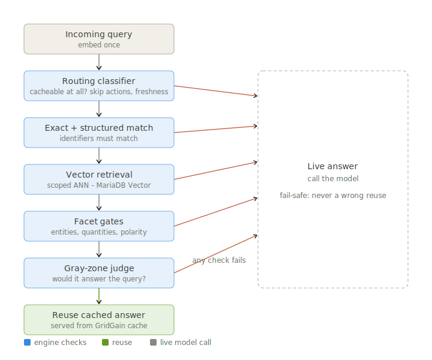

# GatedSemanticCache

**Similarity is not safety.** Most semantic caches decide reuse with one number: cosine similarity above a threshold. That works for FAQ paraphrases. On real traffic — identifiers, negations, freshness, actions — it fails badly.

GatedSemanticCache keeps embeddings as the **retrieval engine** and adds a **control plane** on top: routing, structured matching, facet gates, and an optional bounded gray-zone judge. Each layer can independently veto a reuse. Every veto falls back to a live answer.

> Full write-up with charts and per-trap breakdown: [`docs/blog_draft.md`](docs/blog_draft.md)

---

## The problem

A user asks your assistant: *"Show the dispute details for case #D-7781."* You cache the answer. A minute later another user asks: *"Show the dispute details for case #D-7782."*

The two queries embed to **0.997 cosine similarity**. A standard similarity cache serves the first user's answer to the second. Two different disputes. One wrong answer, zero latency, full confidence.

The usual pattern is simple and cheap:

```
query → embed → nearest neighbor → cosine ≥ 0.85 ? reuse : call the model
```

Off-the-shelf semantic caches (LiteLLM, Redis semantic cache, GPTCache) differ in backends and TTLs, but the **reuse decision** is usually the same: one embedding distance against one cutoff.

That assumes **more similar means safer to reuse**. On many domains, it doesn't.

| Trap type | Example | Typical cosine |
|-----------|---------|----------------|
| Identifier swap | `#D-7781` vs `#D-7782` | 0.997 |
| Negation | "fees waived" vs "fees **NOT** waived" | 0.965 |
| Freshness | "today's mortgage rate" asked tomorrow | ~1.0 (stale) |
| Action | "Cancel my pending Zelle payment" | N/A — not a reusable lookup |

These sit at or above common thresholds. Embeddings can't reliably separate them from genuine paraphrases.


We measured this on a **94-query banking adversarial suite** (27 should-reuse paraphrases, 67 must-not-reuse traps). On high-risk queries, a cosine-only baseline at 0.85 served a **wrong cached answer 51% of the time**. The median trap (0.851) is about as similar as the median paraphrase (0.869); 30 traps were *more* similar to their cached query than the median true paraphrase.

There is no magic threshold. Raise it to block identifier and negation traps and recall collapses. Lower it to catch paraphrases and you serve the traps.

---

## Our approach

**Decide reuse on routing, structure, and intent — not on distance alone.**



Each layer answers a different question:

1. **Routing classifier** — Should this query be cached at all? Labels every query `SEMANTIC_OK`, `EXACT_ONLY`, `THREAD_SCOPED_ONLY`, or `SKIP_CACHE`. Actions, freshness-sensitive lookups, and personal-data requests hit `SKIP_CACHE` *before* any vector lookup.

2. **Exact / structured match** — Do load-bearing identifiers match? `#D-7781` and `#D-7782` produce different structured keys and never collide, regardless of embedding similarity.

3. **Facet gates** — Do entities, quantities, and polarity agree? Catches negation flips, account-type swaps, and named-entity conflicts that embeddings smooth over.

4. **Bounded gray-zone judge** — For borderline cases, one cheap, timeout-bounded LLM call makes the yes/no reuse decision. Post-retrieval, optional, budget-capped — not an LLM on every request.

**Design bias:** a missed cache hit costs latency and money; a wrong cache hit costs trust. We bias hard toward the first.

---

## Results (banking adversarial suite)

Same `text-embedding-3-small` vectors. Baseline: cosine-only at 0.85. GatedSemanticCache: routing + structured match + facet gates + judge (threshold 0.86).

| Metric | GatedSemanticCache | Cosine-only baseline |
|--------|-------------------|----------------------|
| **False reuse** (wrong answers served) | **0%** (0/67) | **51%** (34/67) |
| **Recall** (paraphrases reused) | **67%** (18/27) | 56% (15/27) |


The baseline is worse on **both** axes — not a safety/recall tradeoff. Identifier swaps and negations: **100% false reuse** on the baseline, **0%** on our stack.

Reproduce the eval:

```bash
python3 -m gated_semantic_cache.eval.banking_adversarial_eval --suite full100 \
  --report-json docs/banking_adversarial_report_full100.json
```

See also [`docs/eval_summary_report.md`](docs/eval_summary_report.md) for healthcare, finance, and Quora comparisons.

---

## Quick start

```bash
python -m pip install -e '.[dev]'
```

Copy the sample environment file and add your OpenAI key:

```bash
cp env.example .env
$EDITOR .env
```

At minimum, set:

```bash
OPENAI_API_KEY=...
```

The CLI reads `.env` automatically. You can also pass `--openai-api-key` for one-off runs.

### 1. Start with the REPL

The REPL is the easiest way to learn the cache behavior. It keeps one pipeline alive in memory, so repeated prompts can hit the exact cache or semantic cache while you experiment.

```bash
gated-semantic-cache repl
```

Try these:

```text
query> What is semantic caching?
query> What is semantic caching?
```

The second query should show an exact-cache hit.

Now try a safe paraphrase:

```text
query> instructions for getting from JFK to Manhattan
query> how to get from JFK airport to manhattan
```

The second query should be eligible for semantic reuse if it clears the threshold and gates.

Then try queries that should go live instead of reusing unsafe cache entries:

```text
query> Explain account fees
query> Explain account fees but not overdraft fees
query> what? that is wrong
query> Show today's revenue in apac
```

Look at the JSON trace fields:

- `routing_label`
- `exact_cache_hit`
- `semantic_lookup_attempted`
- `top_candidate_similarity`
- `semantic_post_ann_reject_reason`
- `neighbor_judge_invoked`
- `insert_performed`

Important: `gated-semantic-cache repl` is **in-memory only**. It is for learning and debugging. Its cache disappears when the process exits.

### 2. Tweak `.env`

Useful knobs while experimenting:

```bash
# Embeddings
OPENAI_MODEL=text-embedding-3-small

# Main semantic reuse threshold
SEMANTIC_THRESHOLD=0.86

# Optional low-confidence route downgrade
SEMANTIC_OK_MIN_ROUTE_CONFIDENCE=0.55
EXACT_ONLY_MIN_ROUTE_CONFIDENCE=0.55

# Enable the optional post-retrieval neighbor judge path
NEIGHBOR_JUDGE_ENABLED=1

# Configure the LLM-backed judge used by that path
SEMANTIC_CACHE_DEFAULT_JUDGE=1
SEMANTIC_CACHE_JUDGE_MODEL=gpt-5-mini
SEMANTIC_CACHE_JUDGE_TIMEOUT_SECONDS=5.0
SEMANTIC_CACHE_JUDGE_REASONING_EFFORT=low
SEMANTIC_CACHE_JUDGE_MAX_OUTPUT_TOKENS=128

# Durable cache location for `gated-semantic-cache cache ...`
GATED_SEMANTIC_CACHE_DB=.gated-semantic-cache/cache.sqlite3
```

See `env.example` for the full list.

### 3. Use the durable cache CLI

Use the `cache` subcommands when you want data to survive restarts. They persist rows in SQLite and store a FAISS vector snapshot beside the database.

SQLite + FAISS is the local developer backend. A production persistent distributed cache backend and MariaDB Vector integration for larger scale, shared storage, and better operational performance are planned next.

Default database path:

1. `$GATED_SEMANTIC_CACHE_DB`, if set
2. Otherwise `./.gated-semantic-cache/cache.sqlite3` under the current directory

Write one answer:

```bash
gated-semantic-cache cache put \
  -q "What is semantic caching?" \
  --response-json '{"answer":"Reuse of stored responses.","success":true}'
```

Read it back, even from a new shell:

```bash
gated-semantic-cache cache get \
  -q "What is semantic caching?" \
  --no-judge
```

Inspect or clear the durable store:

```bash
gated-semantic-cache cache stats
gated-semantic-cache cache clear --yes
```

Full CLI reference: [`docs/cli_user_guide.md`](docs/cli_user_guide.md).

### 4. Use it from Python

For app code, start with `SemanticCache.from_sqlite(...)` so exact rows, semantic entries, and the FAISS snapshot persist across processes.

```python
from gated_semantic_cache import JudgePolicy, PutPolicy, SemanticCache

cache = SemanticCache.from_sqlite(
    db_path=".gated-semantic-cache/cache.sqlite3",
    namespace="product-support",
    default_judge_policy=JudgePolicy(enabled=False),
)

try:
    query = "Does the product support namespace isolation?"
    hit = cache.get(query, judge_policy=JudgePolicy(enabled=False))
    if hit is None:
        response = app_fetches_answer(query)
        cache.put(query, response, policy=PutPolicy(semantic_mode="auto"))
        answer = response
    else:
        answer = hit.payload
finally:
    cache.close()
```

`SemanticCache.from_components(...)` is useful for tests and custom backends. If you pass `ExactCache()` and `SemanticStore()` directly, that cache is in-memory unless you add your own persistence.

### 5. Exercise specific pieces

These commands are useful once the basics make sense:

```bash
# Classifier only; no OpenAI key required.
gated-semantic-cache route "Show today's revenue in apac" "Explain semantic caching"

# One-shot live/demo path. This is not the durable cache workflow.
gated-semantic-cache query -q "Explain what semantic caching is"

# Offline checks.
gated-semantic-cache eval routing
python3 -m gated_semantic_cache.eval.banking_adversarial_eval --suite full100 \
  --report-json docs/banking_adversarial_report_full100.json
```

### Tests

```bash
pytest -q
```

Tests use deterministic offline embedding stubs. CLI `query` / `cache get` / `cache put` call the OpenAI embedding API when configured.

---

## Repository layout

- `gated_semantic_cache/` — package (`routing/`, `cache/`, `serving/`, `structured_exact/`, `eval/`, …)
- `tests/` — unit and regression tests
- `docs/` — eval reports, CLI guide, blog draft and figures
- `semantic_cache_redesign_for_cursor.md` — source architecture document

---

## When to use what

- **FAQ-shaped traffic** where wrong reuse is a minor annoyance → a plain cosine cache may be fine. Run your own pairs first.
- **Identifiers, polarity, freshness, or actions** → similarity alone will be confidently wrong exactly when it is most expensive to be. That is what GatedSemanticCache is for.

Bring your own near-duplicate pairs: the eval harness accepts `(cached_query, [candidate, should_reuse])` scenarios. See `gated_semantic_cache/eval/adversarial_cache_eval.py` and the banking suite as a template.
