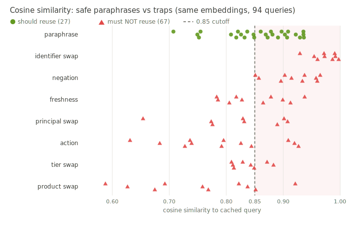
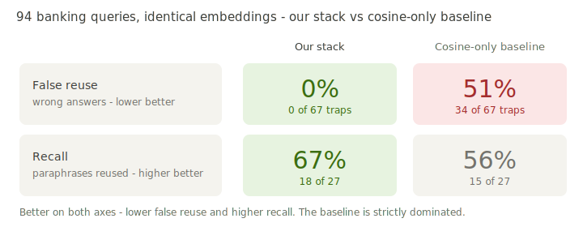
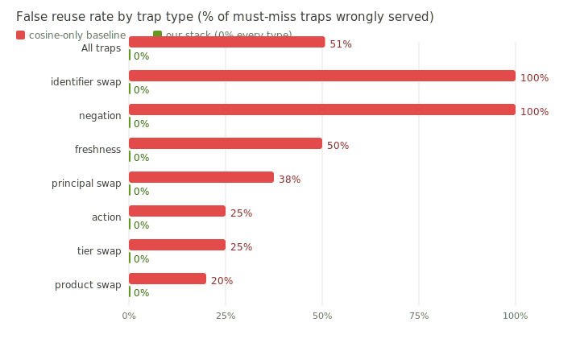

# Similarity is not safety: what we learned building a semantic cache for banking

> Draft — engineering blog. All numbers are from a reproducible eval
> (`gated_semantic_cache/eval/banking_adversarial_eval.py`, `--suite full100`); raw report in
> `docs/banking_adversarial_report_full100.json`. Figures are committed SVGs under
> `docs/blog_assets/`, regenerated from the report by
> `python3 -m gated_semantic_cache.eval.generate_blog_assets`. See "Publishing this post" at the end.

---

A user asks your support assistant, *"Show the dispute details for case #D-7781."* The answer is
expensive to compute, so you cache it. A minute later a different user asks, *"Show the dispute
details for case #D-7782."* Your semantic cache embeds both questions, finds they are **0.997**
cosine-similar — essentially identical to the model — and serves the first user's answer to the
second.

Two different disputes. One wrong answer, delivered with full confidence and zero latency.

We wanted to know how often this actually happens. So we built a 94-query adversarial test set
for retail banking and measured a standard similarity cache against it. On the queries where a
wrong answer matters — identifier lookups, negations, balances, actions — the similarity cache
served a wrong cached answer **51% of the time**. This post is about why that happens, and what
we did instead.

## What semantic caching is supposed to do

LLM calls are slow and expensive. If someone already asked the same question, you should reuse
the answer instead of paying for it again. The hard part is "the same question," because users
never phrase things identically. *"What's the ACH clearing time?"* and *"How many business days
for an ACH transfer to settle?"* deserve the same answer.

The standard solution is elegant: embed every query into a vector, store answers keyed by that
vector, and on a new query find the nearest stored vector. If the cosine similarity is above some
threshold — 0.85 is a common default — reuse the cached answer. Otherwise call the model.

```
query → embed → nearest neighbor → cosine ≥ 0.85 ? reuse : call the model
```

This is genuinely useful. For FAQ-style traffic where paraphrases dominate and a wrong reuse is a
minor annoyance, it works well and it's cheap to run. We are not here to tell you it's worthless.

## The state of the art is one number

If you reach for an off-the-shelf semantic cache today — LiteLLM's proxy cache, Redis's semantic
cache, GPTCache — you'll find the same core under the hood: embed the prompt, find the nearest
cached prompt, compare cosine similarity to a threshold. The pieces around it differ (backends,
namespacing, TTLs), but the *reuse decision* is one number against one cutoff.

That single number is the problem. A threshold assumes that "more similar" means "safer to
reuse." On real traffic, it doesn't.

Consider four kinds of query where the cached answer must **not** be reused, and what cosine
similarity does with them:

- **Identifier swaps.** *"…case #D-7781"* vs *"…case #D-7782"* → 0.997. One digit, completely
  different answer, and the embedding can't see it.
- **Negation.** *"Are international wire fees waived for premium accounts?"* vs *"…**NOT**
  waived?"* → 0.965. Sentence embeddings are near-blind to polarity; the negation barely moves
  the vector.
- **Freshness.** *"What's today's 30-year mortgage rate?"* asked again tomorrow → same embedding,
  stale answer.
- **Actions.** *"Cancel my pending Zelle payment"* is not a question with a reusable answer — it's
  a request to do something, and reusing a prior response across users is meaningless at best and
  dangerous at worst.

Each of these sits *above* a 0.85 threshold or close to it. None of them is safe to reuse. The
threshold has no way to tell them apart from a genuine paraphrase.

We can show this directly. We took 94 banking queries — 27 genuine paraphrases that *should*
reuse, and 67 traps that must not — and plotted every one by its cosine similarity to the cached
query. Same embedding model for all of them.



The two distributions **interleave**. The median trap (0.851) is about as similar as the median
paraphrase (0.869), and **30 of the 67 traps are *more* similar to their cached query than the
median true paraphrase.** Identifier swaps and negations pile up near the top of the scale, at
0.93–0.997 — higher than most of the legitimate paraphrases.

There is no cutoff that works. Set the threshold high enough to reject the negation and
identifier traps and you also reject most real paraphrases — your hit rate collapses. Set it low
enough to catch the paraphrases and you serve every trap. The property a similarity-only cache
depends on — that distance predicts safety — simply does not hold on this traffic.

## What we did instead

Our starting principle: **decide reuse on routing, structure, and intent — not on distance
alone.** Embeddings stay as the retrieval engine. We add a control plane on top of them, and four
checks that can each independently veto a reuse.


Each layer answers a different question:

1. **Routing classifier — should this query be cached at all?** A small, fast classifier labels
   every query: `SEMANTIC_OK`, `EXACT_ONLY`, `THREAD_SCOPED_ONLY`, or `SKIP_CACHE`. Actions,
   freshness-sensitive lookups, and personal-data requests are routed to `SKIP_CACHE` *before*
   any vector lookup happens — they never enter reuse.

2. **Exact / structured match — do the load-bearing identifiers actually match?** When a query
   carries an identifier (a case number, an account, a wire ID), reuse requires that identifier
   to match exactly. *"#D-7781"* and *"#D-7782"* produce different structured keys, so they can
   never collide regardless of how similar their embeddings are.

3. **Facet gates — do the entities, quantities, and polarity agree?** Deterministic checks catch
   negation flips, account-type swaps, and named-entity conflicts that the embedding smooths over.

4. **Bounded neighbor judge — in the gray zone, would this answer actually answer the new
   question?** For borderline cases, a single cheap, timeout-bounded LLM call makes the
   yes/no reuse decision. It's post-retrieval, optional, and budget-capped — not an LLM on every
   request.

The critical design choice: **every veto falls back to a live answer.** A missed cache hit costs
latency and money. A wrong cache hit costs trust. We bias hard toward the first.

## Results

We ran both systems on the same 94 queries, using the **same `text-embedding-3-small` vectors**.
The only difference is the control plane: the baseline is cosine-only at 0.85; our stack adds the
four layers above. (Threshold 0.86, judge enabled.)

| Metric | Our stack | Cosine-only baseline |
|--------|-----------|----------------------|
| **False reuse rate** (wrong answers served) | **0%** (0/67) | **51%** (34/67) |
| **Recall** (real paraphrases reused) | **67%** (18/27) | 56% (15/27) |



The cosine cache is worse on *both* axes at once: it serves wrong answers on half the traps **and**
recovers fewer genuine paraphrases. That's not a safety/recall tradeoff — it's strictly dominated.
The reason it under-performs on recall too is the same overlap problem: many real paraphrases sit
at 0.71–0.85, below the cutoff, so the baseline misses them while happily serving traps above it.

Breaking the false reuse down by trap type makes the failure legible:



| Trap type | Baseline false reuse | Our stack |
|-----------|---------------------|-----------|
| Identifier swap | **100%** (9/9) | 0% |
| Negation | **100%** (10/10) | 0% |
| Freshness | 50% (5/10) | 0% |
| Principal swap | 38% (3/8) | 0% |
| Destructive action | 25% (3/12) | 0% |
| Tier swap | 25% (2/8) | 0% |
| Product swap | 20% (2/10) | 0% |

Walk one trap through the stack to see why the numbers come out this way. The *"#D-7782"* dispute
lookup never reaches the vector index: the router labels it `EXACT_ONLY` because it carries an
identifier, the structured key built from *#D-7782* doesn't match the cached *#D-7781* key, and
the lookup returns a miss → live answer. Cosine similarity (0.997) never enters the decision. The
negations are caught later, by the facet gate and the judge, on intent and polarity rather than
distance.

This pattern isn't unique to banking. We see the same shape on a curated healthcare set (40%
baseline false reuse → 0%, including a 0.96-similarity Type 1 vs Type 2 diabetes trap) and a
personal-finance set (50% → 0%, including a reversed IRA-rollover trap at 0.97). On general Quora
paraphrases, where wrong reuse is cheap, the gap narrows to 6.2% vs 4.2% — similarity-only is
genuinely fine there. The stack earns its complexity on the tails, not the average.

### What it costs us — honestly

A "0% false positives" claim with no caveats is marketing. Here's the bill.

- **We miss about a third of genuine paraphrases.** Recall is 67%, not 95%. Every miss is a
  *conservative* miss — the user gets a correct, freshly-computed answer, never a wrong cached
  one — but it's real money and latency left on the table. On this run the misses came from the
  facet gate over-rejecting a few non-conflicts and the judge being too strict in the gray zone;
  both are tunable, and recall is where our current work is focused.
- **The judge adds an LLM call in the gray zone.** It's bounded and optional, but it's not free —
  it has a cost and a latency tail. High-similarity and clear-cut cases skip it.
- **These benchmarks are curated and modest.** 94 banking queries, 12 healthcare, 32 finance.
  They're adversarial by design, which is the point, but they're not a substitute for your own
  traffic. Which brings us to —

## Try it on your own traps

The eval harness and datasets are inspectable, and the comparison reproduces with one command:

```bash
python3 -m gated_semantic_cache.eval.banking_adversarial_eval --suite full100 \
  --report-json banking_report.json
```

It prints the side-by-side scoreboard (our stack vs the cosine-only baseline) and per-trap-type
breakdown, and writes every row — query, routing label, similarity, the reason each reuse was
allowed or vetoed — to JSON.

The most useful thing you can do is bring your own pairs. The suite is just a list of
`(cached_query, [candidate, should_reuse])` scenarios; drop in the near-duplicates from your
domain that would be expensive to get wrong, and see where a similarity threshold would have
served them. If your traffic is genuinely FAQ-shaped, you may find a plain cosine cache is fine —
and that's a useful thing to learn before you ship one.

## What's next

Everything above runs on a single-process research stack: a local FAISS index for retrieval and
an in-memory store for cached answers. The control plane — routing, structured match, facet
gates, judge — is the part we've been validating, and it's backend-agnostic by design. The next
phase is putting it on a production-grade backend, and we're building that on infrastructure we
already trust:

- **A secure backend service.** A proper service boundary around the engine: authentication,
  per-tenant namespace isolation enforced server-side, request quotas and judge budgets per
  tenant, and full audit traces (routing label, similarity, veto reason) for every decision.
- **MariaDB Vector for retrieval.** The nearest-neighbor search moves from FAISS to
  [MariaDB Vector](https://mariadb.com/), so the embedding index lives next to the relational
  data and scales with the database we already operate — one system to secure, back up, and
  scale, with SQL-native vector search instead of a separate vector store.
- **GridGain as the distributed TTL cache.** Cached answers and exact-key lookups move to GridGain
  as a horizontally-scalable, in-memory distributed cache with native TTL/eviction — so reuse is
  shared across nodes and entries expire correctly under freshness policy, rather than living in
  one process's heap.
- **Recovering recall without giving back safety.** The facet gate and gray-zone judge are the two
  levers; the goal is to lift the 67% without reopening the 0%.
- **More domains and per-tenant calibration.** Legal and ops trap suites, and letting each
  namespace tune its own gray-zone behavior — strict zero-FPR for regulated tenants, looser reuse
  for low-risk FAQ tenants.

The architecture is deliberately layered so this swap is mechanical: the decision logic doesn't
care whether retrieval is FAISS or MariaDB Vector, or whether the answer store is a dict or
GridGain. Safety lives in the control plane; scale lives in the backend.

The takeaway is small and, we think, hard to argue with once you see the overlap chart:
similarity tells you two questions *look* alike. It doesn't tell you they have the *same answer*.
For a lot of real traffic — anything with identifiers, polarity, freshness, or actions — those
are different questions, and a cache that can't tell them apart will be confidently wrong exactly
when it's most expensive to be.

---

## Publishing this post

The four figures are self-contained SVGs in `docs/blog_assets/` (`cosine_overlap.svg`,
`fpr_by_trap_type.svg`, `scoreboard.svg`, `architecture.svg`). They use explicit light-theme
colors and no external CSS, so they render anywhere. To regenerate them from the latest eval:

```bash
python3 -m gated_semantic_cache.eval.banking_adversarial_eval --suite full100 \
  --report-json docs/banking_adversarial_report_full100.json
python3 -m gated_semantic_cache.eval.generate_blog_assets   # rewrites docs/blog_assets/*.svg
```

Three ways to render the finished post, in order of least effort:

1. **GitHub / GitLab / Obsidian / Notion import** — these render Markdown with relative-path SVG
   images natively. Push `blog_draft.md` + `blog_assets/` and it just works.
2. **Static HTML (when `pandoc` is available):**
   ```bash
   pandoc docs/blog_draft.md -s --embed-resources -o blog.html
   ```
   `--embed-resources` inlines the SVGs so `blog.html` is a single shippable file.
3. **CMS (WordPress, Ghost, etc.)** — paste the Markdown body and upload the four SVGs as media,
   or convert any SVG to PNG first (`rsvg-convert fig.svg -o fig.png`, or open the SVG in a browser
   and export) if your CMS doesn't accept SVG uploads.

No image is a screenshot — every figure is generated from `banking_adversarial_report_full100.json`,
so a re-run keeps the prose, the tables, and the charts in sync automatically.
